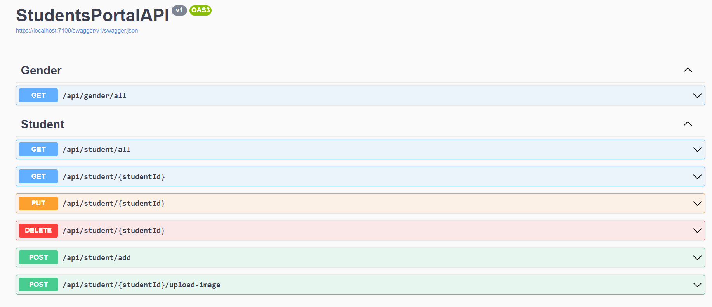

# StudentsPortal
Simple students portal for managing students data based on Angular FrontEnd and .NET Api Backend without authentication. Project is just for learning purposes so it does not cover all aspects of typical web project(no users,roles,authentication and etc).

Project supports basic CRUD operations over student entity.

## Used technologies
* .NET 6 API
* Angular
* Angular Materials

## Sample images:

**Students list**
 

**Student details**
 

**Student details**
 

**Frontend validations**
 

**Swagger Api**

